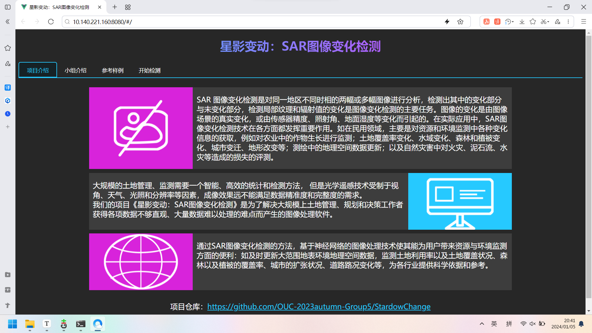

# StardowChange
星影变动：基于python神经网络学习的SAR图像变化检测系统-web

中国海洋大学软件工程2023秋第五小组课程项目

小组成员：王星苹 董继坤 李满鹏 王祥

## 项目简介： 

SAR 图像变化检测是对同一地区不同时相的两幅或多幅图像进行分析，检测出其中的变化部分与未变化部分，检测局部纹理和辐射值的变化是图像变化检测的主要任务。图像的变化是由图像场景的真实变化，或由传感器精度、照射角、地面湿度等变化而引起的。在实际应用中，SAR图像变化检测技术在各方面都发挥重要作用。如在民用领域，主要是对资源和环境监测中各种变化信息的获取，例如对农业中的作物生长进行监测；土地覆盖率变化、水域变化、森林和植被变化、城市变迁、地形改变等；测绘中的地理空间数据更新；以及自然灾害中对火灾、泥石流、水灾等造成的损失的评测。

大规模的土地管理、监测需要一个智能、高效的统计和检测方法， 但是光学遥感技术受制于视角、天气、光照和分辨率等因素，成像效果远不能满足数据精准度和完整度的需求。

我们的项目《星影变动：SAR图像变化检测》是为了解决大规模上土地管理、规划和决策工作者获得各项数据不够直观、大量数据难以处理的难点而产生的图像处理软件。 ,通过SAR图像变化检测的方法，基于神经网络的图像处理技术使其能为用户带来资源与环境监测方面的便利：如及时更新大范围地表环境地理空间数据，监测土地利用率以及土地覆盖状况、森林以及植被的覆盖率、城市的扩张状况、道路路况变化等，为各行业提供科学依据和参考。

主页面如下：

运行实况如下：

开发例会记录：[例会记录.md](https://github.com/OUC-2023autumn-Group5/StardowChange/blob/main/%E4%BE%8B%E4%BC%9A%E8%AE%B0%E5%BD%95.md)

项目演示视频：TBA
